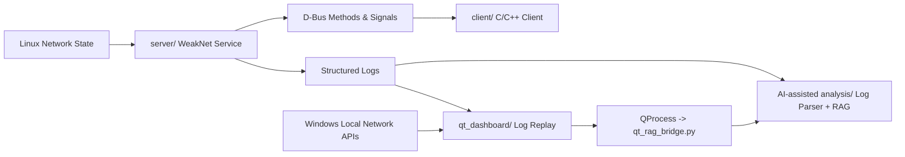
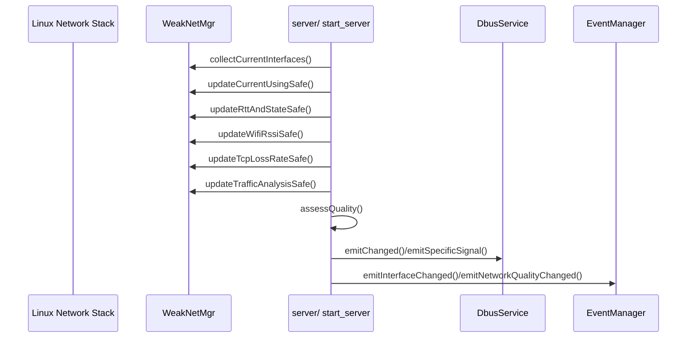
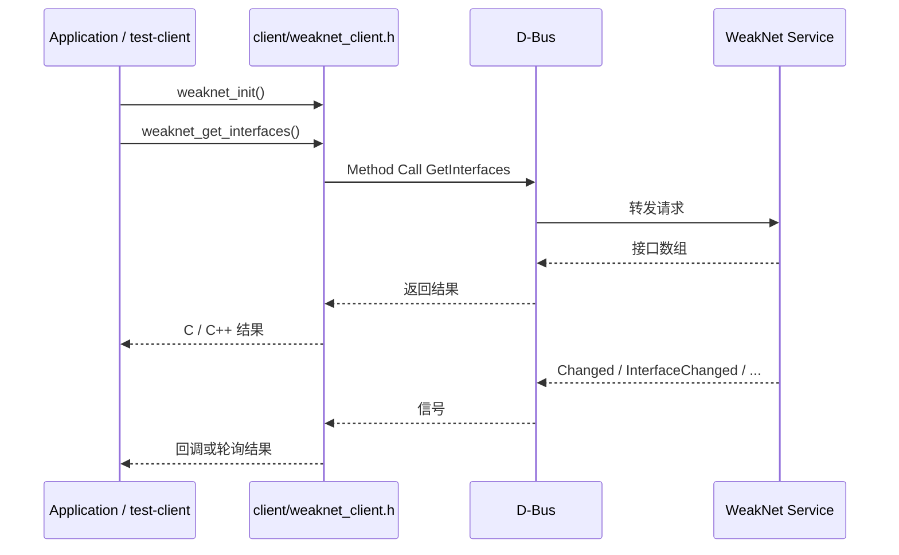
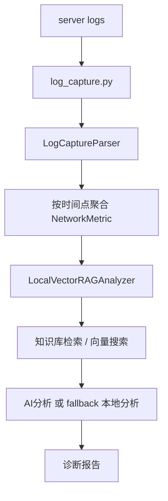
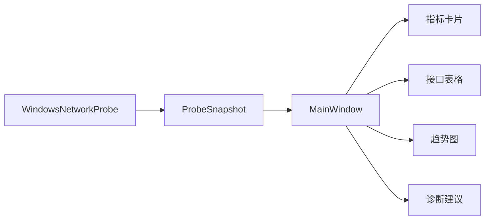
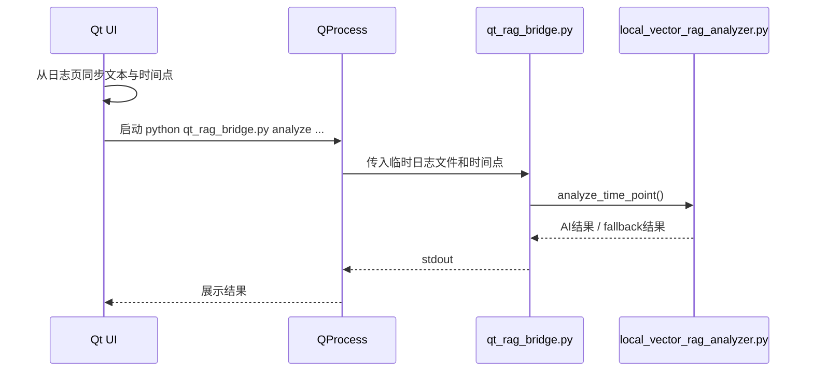

# AI-powered-Network-Diagnostics / WeakNet

一个以 **Linux 实时网络监控核心** 为基础、并扩展出 **Python AI/RAG 分析链路** 与 **Windows Qt 可视化界面** 的网络诊断项目。

当前仓库可以理解为三条并行但互相协作的产品线：

1. `server/ + client/`
   Linux 侧实时网络监控与 D-Bus 服务/客户端库。
2. `AI-assisted analysis/`
   面向日志的 Python 解析、知识库检索、RAG 分析与交互式诊断。
3. `qt_dashboard/`
   Windows 侧 Qt Widgets 桌面界面，支持实时本机采样、日志回放、调用 Python RAG 分析。

这份 `README.md` 以**当前仓库状态**为准，重点说明：

- 现在到底有哪些功能
- 各模块之间怎么交互
- 实际用了哪些技术栈
- 每个重要文件是做什么的
- Linux / Windows 各自应该怎么构建和运行

---

## 1. 项目概览

### 1.1 这个项目解决什么问题

项目面向“网络质量监控与故障定位”场景，提供以下能力：

- 发现并维护当前可用网络接口
- 判断当前真正用于上网的主接口
- 采集 RTT、TCP 丢包率、Wi-Fi RSSI、流量等指标
- 计算网络质量评分并发出事件
- 通过 D-Bus 对外提供接口与信号
- 将服务端日志结构化为可读网络事件
- 对某个时间点的网络状态做知识库增强分析
- 在 Windows 上通过 Qt 图形界面展示实时数据、日志回放和 AI 诊断

### 1.2 当前版本的核心特点

- Linux 侧监控核心：`C++17 + D-Bus + eBPF/libbpf`
- Python AI 分析：`日志解析 + 知识库 + 向量检索 + 可选大模型分析 + fallback 本地分析`
- Windows 图形界面：`Qt Widgets + .ui + WinAPI 采样 + QProcess 调 Python`
- 项目已经包含：
  - Qt Creator 友好的 `.ui` 界面工程
  - Windows 启动脚本
  - Qt 页面对 Python RAG 的联动入口

### 1.3 当前推荐理解方式

如果你是第一次接触这个仓库，建议按下面顺序理解：

1. 先看本 README 的“整体架构”和“交互流程”
2. 再看 `server/` 理解 Linux 监控主干
3. 然后看 `AI-assisted analysis/` 理解日志分析链路
4. 最后看 `qt_dashboard/` 理解 Windows GUI 是如何复用前两部分语义的

---

## 2. 当前技术栈

### 2.1 按模块划分的技术栈

| 模块 | 主要技术 | 作用 |
| --- | --- | --- |
| Linux 监控服务端 | C++17, libdbus-1, glog, libbpf, clang(eBPF), netlink, raw socket, wpa_supplicant control | 采集网络状态、评估质量、通过 D-Bus 暴露服务 |
| Linux 客户端库 | C++17, libdbus-1 | 调用服务端方法、监听信号、提供 C/C++ API |
| Python AI 分析 | Python 3, regex, numpy, FAISS, LangChain, OpenAI-compatible client, DashScope-compatible endpoint | 解析日志、构建知识库、按时间点做 RAG 分析 |
| Windows Qt 图形界面 | Qt 6 Widgets, qmake, `.ui`, QProcess | 实时展示网络状态、日志回放、触发 AI 分析 |
| Windows 本机采样 | WinAPI, Icmp, Iphlpapi, Wlanapi, Ws2_32 | 获取接口、RTT、吞吐、RSSI、连接数 |

### 2.2 更细的技术点

#### Linux 侧

- **D-Bus**
  - 服务名：`com.example.WeakNet`
  - 对象路径：`/com/example/WeakNet`
  - 接口名：`com.example.WeakNet`
- **eBPF / libbpf**
  - `flow_rate.bpf.c` 负责内核侧流量采样
  - 用户态通过 `net_traffic.cpp` / `traffic_analyzer.cpp` 获取统计
- **网络采样方式**
  - netlink：接口与路由信息
  - ICMP ping：RTT
  - `/proc/net/netstat`、接口统计：TCP 丢包相关
  - wpa_supplicant control socket：Wi-Fi RSSI

#### Python 侧

- **日志解析**
  - 正则匹配 `log_capture.py` 产生的结构化文本
- **RAG 能力**
  - 内置知识库 `network_knowledge_base.py`
  - 向量化：本地简单 embedding + FAISS
  - 模型调用：OpenAI 兼容客户端访问 DashScope 兼容接口
- **降级策略**
  - 没有向量库/模型依赖时仍可做 fallback 本地分析

#### Windows Qt 侧

- **界面技术**
  - `Qt Widgets`
  - `qmake`
  - `mainwindow.ui` 可直接用 Qt Creator 拖拽编辑
- **动态图表**
  - 自定义控件 `TrendChartWidget`
  - 可通过 Qt Designer 的 Promote 机制使用
- **Python 联动**
  - `QProcess` 调用 `AI-assisted analysis/qt_rag_bridge.py`
  - 可从 GUI 中直接触发 Python RAG 分析

---

## 3. 整体架构

### 3.1 仓库总体结构

```text
AI-powered-Network-Diagnostics-main/
├── server/                 Linux 监控服务端
├── client/                 D-Bus 客户端库与测试程序
├── AI-assisted analysis/   Python 日志分析与 RAG 诊断
├── qt_dashboard/           Windows Qt 桌面界面
├── logs/                   日志配置
├── Makefile                根构建入口
├── config.mk               根路径与输出目录配置
├── install.sh              Linux 侧安装/构建辅助脚本
├── run_windows_dashboard.bat
└── README*.md              补充文档
```

### 3.2 模块关系图



### 3.3 当前两种运行形态

#### 形态 A：Linux 监控核心

用于真实跑 `D-Bus + eBPF + 各监控线程`。

#### 形态 B：Windows 图形界面

不直接运行 Linux 的 D-Bus/eBPF 服务，而是：

- 一部分通过 Windows 本机 API 实时采样
- 一部分通过导入 Linux 服务端日志回放
- 一部分通过调用 Python 分析脚本做 AI 诊断

---

## 4. 当前对外能力

### 4.1 D-Bus 方法

来自 `server/include/common.hpp` 和 `server/include/dbus_service.hpp`：

| 方法名 | 含义 |
| --- | --- |
| `Get` | 示例字符串返回 |
| `ListInterfaces` | 返回接口列表 |
| `GetInterfaces` | 返回接口列表，客户端常用 |
| `HealthCheck` | 网络健康检查 |
| `Ping` | 通过当前主接口对目标主机执行 ping |

### 4.2 D-Bus / 事件信号

| 信号名 | 含义 |
| --- | --- |
| `Changed` | 通用变化信号 |
| `InterfaceChanged` | 接口添加/移除/切换 |
| `ConnectionModeChanged` | 当前上网方式或主接口变化 |
| `NetworkQualityChanged` | 综合质量变化 |

### 4.3 事件类型

来自 `server/include/event_manager.hpp`：

- `InterfaceChanged`
- `ConnectionModeChanged`
- `NetworkQualityChanged`
- `TcpLossRateChanged`
- `RttChanged`
- `RssiChanged`

### 4.4 Qt 图形界面页面

当前 `qt_dashboard/src/mainwindow.ui` 中包含四个主要页签：

1. `实时总览`
2. `项目日志回放`
3. `AI RAG 诊断`
4. `知识库与兼容说明`

---

## 5. 交互流程

## 5.1 Linux 服务端内部流程



### 5.1.1 线程模型

`server/src/server.cpp` 会启动多个长期运行线程：

- 接口监控线程
- 当前上网接口监控线程
- RTT 监控线程
- RSSI 监控线程
- TCP 丢包监控线程
- 流量分析线程
- 网络质量监控线程

### 5.1.2 每轮采集的大致动作

1. 收集当前接口列表
2. 判断哪张网卡是正在上网的主接口
3. 对主接口做 RTT 更新
4. 对 Wi-Fi 接口做 RSSI 更新
5. 更新 TCP 丢包率
6. 更新流量统计
7. 综合评估网络质量
8. 有变化则通过 D-Bus 和事件管理器发出通知

---

## 5.2 Linux 客户端调用流程



### 5.2.1 客户端支持的两种使用方式

- **命令行测试程序**
  - `client/test_client.cpp`
- **动态库 / API 接口**
  - `client/client.cpp`
  - `client/weaknet_client.h`

### 5.2.2 典型命令

```bash
make all
make run-server
make test-client COMMAND=get
make test-client COMMAND=health
make test-client COMMAND=check
make test-client COMMAND=subscribe
make test-client COMMAND=ping google.com
```

---

## 5.3 Python 日志分析 / RAG 流程



### 5.3.1 Python 侧当前主入口

- CLI / 交互式：`AI-assisted analysis/interactive_rag.py`
- Qt 桥接：`AI-assisted analysis/qt_rag_bridge.py`
- 主分析器：`AI-assisted analysis/local_vector_rag_analyzer.py`

### 5.3.2 按时间点分析的核心逻辑

1. 读取日志文本
2. 用正则把 RTT / 丢包 / RSSI / 流量 / 质量行解析成 `NetworkMetric`
3. 过滤出指定 `HH:MM:SS` 的记录
4. 组装问题上下文
5. 检索知识库
6. 如果外部模型与向量能力可用，则做增强分析
7. 否则做 fallback 本地分析并输出报告

---

## 5.4 Windows Qt 图形界面流程

### 5.4.1 实时总览流程



### 5.4.2 日志回放流程

1. 用户粘贴或打开日志
2. `ProjectLogParser` 解析文本
3. 提取可用时间点
4. 选中某个时间点后聚合为接口级指标
5. 更新表格、曲线和文字诊断

### 5.4.3 AI 页联动流程



### 5.4.4 Windows 界面的限制

Qt 界面**不会直接启动 Linux 服务端**。因为当前服务端依赖：

- Linux D-Bus
- eBPF / libbpf
- netlink / wpa_supplicant 等 Linux 环境

所以 Windows GUI 采用的是：

- 本机采样
- 项目日志回放
- Python RAG 联动

这三条链路来复用项目能力。

---

## 6. 构建与运行

## 6.1 Linux 侧构建

### 6.1.1 依赖

至少需要：

- `g++`
- `clang`
- `pkg-config`
- `libdbus-1-dev`
- `libglog-dev`
- `libbpf-dev`
- `libelf-dev`
- `zlib1g-dev`
- 对应内核头文件

### 6.1.2 根目录构建

```bash
make all
```

这会：

- 进入 `server/` 构建服务端
- 构建客户端动态库 `client/lib/libweaknet.so`
- 构建客户端测试程序 `client/bin/test-client`

### 6.1.3 仅构建服务端

```bash
make -C server
```

### 6.1.4 运行服务端

```bash
make run-server
```

或：

```bash
./server/bin/weaknet-dbus-server
```

### 6.1.5 运行客户端测试

```bash
make test-client COMMAND=get
make test-client COMMAND=health
make test-client COMMAND=check
make test-client COMMAND=subscribe
make test-client COMMAND=ping google.com
```

### 6.1.6 清理

```bash
make clean
make -C server clean
```

---

## 6.2 Python AI 分析运行

### 6.2.1 依赖安装

```bash
cd "AI-assisted analysis"
pip install -r requirements.txt
```

如果你只想先跑 fallback 分析，部分依赖缺失也能运行，但：

- 没有 `openai` / `langchain` / `faiss` 时无法使用完整向量 RAG
- 仍可保留基础日志解析和 fallback 报告

### 6.2.2 配置模型密钥

可选方式：

- 设置环境变量 `DASHSCOPE_API_KEY`
- 或在脚本中传入/填写 API key

### 6.2.3 交互式运行

```bash
cd "AI-assisted analysis"
python interactive_rag.py
```

### 6.2.4 Qt 桥接脚本独立调用

```bash
cd "AI-assisted analysis"
python qt_rag_bridge.py analyze --log-file sample.log --time-point 00:13:24
```

---

## 6.3 Windows Qt 图形界面构建

### 6.3.1 Qt Creator 打开方式

用 Qt Creator 打开：

```text
qt_dashboard/WeakNetDashboard.pro
```

推荐 Kit：

- `Qt 6.x + MSVC 64-bit`

### 6.3.2 一键脚本

仓库根目录：

```bat
run_windows_dashboard.bat
```

或 Qt 子目录：

```bat
qt_dashboard\run_windows_gui.bat
```

### 6.3.3 手动构建

```powershell
cd qt_dashboard
mkdir build_qt6
cd build_qt6
qmake ..\WeakNetDashboard.pro
nmake
.\bin\WeakNetDashboard.exe
```

### 6.3.4 当前 Qt 工程特性

- 使用 `qmake`
- 使用 `mainwindow.ui`
- 自定义控件 `TrendChartWidget`
- Qt 页面内可直接调 Python RAG

---

## 7. 当前目录与文件职责

这一节按目录列出**当前主要文件的职责**，可以直接当代码导航使用。

## 7.1 根目录文件

| 文件 | 作用 |
| --- | --- |
| `README.md` | 当前权威总说明文档 |
| `README_PROJECT.md` | 早期项目总览说明 |
| `README_EVENTS.md` | 事件系统相关补充文档 |
| `PING_FEATURE_SUMMARY.md` | Ping 相关特性说明 |
| `PATH_OPTIMIZATION_SUMMARY.md` | 路径/接口优化相关说明 |
| `TEST_CLIENT_OPTIMIZATION_SUMMARY.md` | 客户端测试优化说明 |
| `Makefile` | 根构建入口，负责联动 server/client |
| `config.mk` | 根路径、输出目录、共享构建变量 |
| `install.sh` | Linux 侧依赖安装/构建辅助脚本 |
| `run_windows_dashboard.bat` | Windows 根入口脚本，转发到 Qt Dashboard 构建/运行脚本 |
| `.gitignore` | 忽略 Qt build、Linux 构建产物、缓存和临时文件 |
| `logs/config/glog.conf` | glog 日志配置文件 |

---

## 7.2 `server/include/` 头文件职责

| 文件 | 作用 |
| --- | --- |
| `common.hpp` | D-Bus 常量、方法名、信号名、序列化文件名定义 |
| `server.hpp` | 服务端入口声明、`ServerContext` 线程/共享上下文定义 |
| `dbus_service.hpp` | D-Bus 注册、方法处理、信号发送封装 |
| `looper.hpp` | 主线程 D-Bus 消息循环封装 |
| `event_manager.hpp` | 网络事件类型、事件对象、事件广播管理器 |
| `logger.hpp` | glog 封装、模块化日志级别与宏 |
| `net_info.hpp` | `NetInfo` 网络接口数据模型 |
| `net_iface.h` | 网络接口发现与基础信息收集接口 |
| `using_iface.h` | 当前“正在上网”接口识别器 |
| `net_ping.h` | ICMP ping / RTT 测量接口 |
| `rtt_monitor.hpp` | RTT 监控线程入口 |
| `rssi_monitor.hpp` | Wi-Fi RSSI 监控线程入口 |
| `net_wifiriss.h` | 通过 wpa_supplicant control 获取 RSSI 的客户端 |
| `net_tcp.h` | TCP 统计与丢包率计算接口 |
| `tcp_loss_monitor.hpp` | TCP 丢包率监控线程入口 |
| `net_traffic.h` | 流量统计、异常、历史等数据结构与采样接口 |
| `traffic_analyzer.hpp` | 流量分析线程管理器 |
| `traffic_anomaly_detector.h` | 高级流量异常检测模型与结果结构 |
| `network_quality_assessor.hpp` | 综合质量评分模型、阈值、问题检测 |
| `weak_netmgr.hpp` | 核心弱网管理器，负责汇总并安全更新所有指标 |
| `serializer.hpp` | 序列化 `ChangedPayload` 和方法返回值的工具 |

---

## 7.3 `server/src/` 源文件职责

| 文件 | 作用 |
| --- | --- |
| `main.cpp` | 服务端程序入口，调用 `start_server()` |
| `server.cpp` | 服务端主编排：初始化 D-Bus、启动各监控线程、运行主循环 |
| `dbus_service.cpp` | D-Bus 方法处理与信号发送实现 |
| `looper.cpp` | D-Bus 事件循环实现 |
| `event_manager.cpp` | 事件总线实现，把内部事件转为 D-Bus 信号 |
| `logger.cpp` | 日志系统初始化与输出实现 |
| `serializer.cpp` | 二进制序列化/反序列化实现 |
| `net_info.cpp` | `NetInfo` 相关实现（如有） |
| `net_iface.cpp` | 通过 netlink 收集接口、地址、路由等基础信息 |
| `using_iface.cpp` | 判断当前默认路由/当前上网接口 |
| `weak_netmgr.cpp` | 汇总接口状态，并线程安全地更新 RTT / RSSI / 丢包 / 流量 |
| `net_ping.cpp` | ICMP 发包、回包、RTT 计算 |
| `rtt_monitor.cpp` | RTT 监控线程实现 |
| `net_wifiriss.cpp` | Wi-Fi RSSI 读取实现 |
| `rssi_monitor.cpp` | RSSI 监控线程实现 |
| `net_tcp.cpp` | TCP 统计读取与丢包率计算 |
| `tcp_loss_monitor.cpp` | TCP 丢包率监控线程实现 |
| `flow_rate.bpf.c` | eBPF 程序，采集连接/流量计数 |
| `net_traffic.cpp` | 用户态读取 eBPF map、聚合实时流量 |
| `traffic_analyzer.cpp` | 流量分析线程与缓存实现 |
| `traffic_anomaly_detector.cpp` | 流量异常检测逻辑实现 |
| `network_quality_assessor.cpp` | 综合质量评分、问题识别、JSON 详情生成 |

---

## 7.4 `client/` 文件职责

| 文件 | 作用 |
| --- | --- |
| `weaknet_client.h` | 对外 C API 声明，供其他程序接入 |
| `client.cpp` | `WeakNetClient` 实现，封装 D-Bus 客户端逻辑与 C API 导出 |
| `test_client.cpp` | 综合测试入口，覆盖接口获取、事件、健康检查、Ping 等 |
| `test_network_quality.cpp` | 网络质量相关测试 |
| `ping_example.cpp` | Ping 功能示例 |
| `example_usage.cpp` | API 使用示例 |
| `README_CLIENT.md` | 客户端使用说明 |
| `README_LIBRARY.md` | 动态库/链接相关说明 |

---

## 7.5 `AI-assisted analysis/` 文件职责

| 文件 | 作用 |
| --- | --- |
| `README.md` | AI 分析子目录说明 |
| `RAG_SERVICE_GUIDE.md` | RAG 服务详细使用指南 |
| `requirements.txt` | Python 依赖列表 |
| `install_rag.sh` | RAG 依赖安装辅助脚本 |
| `network_knowledge_base.py` | 内置网络知识库定义 |
| `log_capture.py` | 将服务端终端输出重构为可读指标日志 |
| `local_vector_rag_analyzer.py` | 当前最重要的本地向量 RAG 分析器 |
| `interactive_rag.py` | 交互式 CLI，适合人工分析日志 |
| `qt_rag_bridge.py` | Qt 到 Python 的桥接脚本，供 GUI 调用 |
| `simple_rag_analyzer.py` | 简化版分析器，偏规则与文本匹配 |
| `vector_rag_analyzer.py` | 云向量 RAG 版本 |
| `true_rag_analyzer.py` | 更完整的 RAG 尝试版本 |
| `optimized_network_rag.py` | 优化版历史/实验分析器 |
| `test_dashscope_api.py` | DashScope/OpenAI compatible API 测试脚本 |

### 说明

AI 目录里有几种“同类分析器”并存，当前建议优先理解：

1. `local_vector_rag_analyzer.py`
2. `interactive_rag.py`
3. `qt_rag_bridge.py`

其余分析器可以视为不同阶段的实验/替代实现。

---

## 7.6 `qt_dashboard/` 文件职责

| 文件 | 作用 |
| --- | --- |
| `README.md` | Qt 仪表盘子项目说明 |
| `WeakNetDashboard.pro` | qmake 工程文件 |
| `run_windows_gui.bat` | Qt 子项目的一键构建/启动脚本 |
| `src/main.cpp` | Qt 程序入口 |
| `src/mainwindow.ui` | 主界面 `.ui` 文件，可直接用 Qt Creator 拖拽编辑 |
| `src/mainwindow.h` | 主窗口与 `ProbeWorker` 声明 |
| `src/mainwindow.cpp` | 主窗口逻辑、数据绑定、AI RAG 调用、样式初始化 |
| `src/models.h` | Qt 侧数据模型、评分辅助函数 |
| `src/windows_network_probe.h` | Windows 实时采样器声明 |
| `src/windows_network_probe.cpp` | WinAPI 采样实现：接口、Ping、RSSI、吞吐、连接数 |
| `src/project_log_parser.h` | Qt 侧日志解析器声明 |
| `src/project_log_parser.cpp` | 兼容 `log_capture.py` 输出的日志解析器实现 |
| `src/trend_chart_widget.h` | 自定义趋势图控件声明 |
| `src/trend_chart_widget.cpp` | 自定义趋势图绘制逻辑 |

---

## 8. 当前推荐的阅读顺序

如果你要做二次开发，推荐按下面顺序读代码：

### 8.1 想理解 Linux 监控主干

1. `server/include/server.hpp`
2. `server/src/server.cpp`
3. `server/include/weak_netmgr.hpp`
4. `server/src/weak_netmgr.cpp`
5. `server/include/network_quality_assessor.hpp`
6. `server/src/network_quality_assessor.cpp`

### 8.2 想理解 D-Bus 对外接口

1. `server/include/common.hpp`
2. `server/include/dbus_service.hpp`
3. `server/src/dbus_service.cpp`
4. `client/weaknet_client.h`
5. `client/client.cpp`

### 8.3 想理解 AI 分析链路

1. `AI-assisted analysis/log_capture.py`
2. `AI-assisted analysis/network_knowledge_base.py`
3. `AI-assisted analysis/local_vector_rag_analyzer.py`
4. `AI-assisted analysis/interactive_rag.py`
5. `AI-assisted analysis/qt_rag_bridge.py`

### 8.4 想理解 Windows Qt GUI

1. `qt_dashboard/src/mainwindow.ui`
2. `qt_dashboard/src/mainwindow.cpp`
3. `qt_dashboard/src/windows_network_probe.cpp`
4. `qt_dashboard/src/project_log_parser.cpp`
5. `qt_dashboard/src/trend_chart_widget.cpp`

---

## 9. 当前已知边界与注意事项

### 9.1 Linux 与 Windows 不是一套完全相同的运行环境

- Linux 侧是真实监控核心
- Windows 侧是兼容化 GUI 层

所以：

- Linux 侧强调 D-Bus、eBPF、实时线程监控
- Windows 侧强调本机采样、日志回放、Python RAG 联动

### 9.2 Python RAG 依赖可能不完整

如果未安装：

- `openai`
- `langchain`
- `faiss-cpu`

则仍可能进入 fallback 分析，但不会拥有完整向量 RAG 能力。

### 9.3 某些旧文档与当前仓库状态可能不完全一致

仓库里保留了多份阶段性说明文件，例如：

- `README_PROJECT.md`
- `README_EVENTS.md`
- `PING_FEATURE_SUMMARY.md`
- `PATH_OPTIMIZATION_SUMMARY.md`

这些文档仍有价值，但以**当前这份 `README.md`** 为主。

### 9.4 Windows Qt Creator 相关

当前推荐：

- Qt 6
- MSVC 64-bit Kit

不建议混用：

- Qt 5 生成的旧 build 目录
- Anaconda 自带 Qt 5 工具链
- 没有 MSVC 标准库环境的裸 `nmake`

---

## 10. 常用命令速查

### Linux 服务端 / 客户端

```bash
make all
make run-server
make test-client COMMAND=get
make test-client COMMAND=health
make test-client COMMAND=ping google.com
```

### Python AI

```bash
cd "AI-assisted analysis"
pip install -r requirements.txt
python interactive_rag.py
python qt_rag_bridge.py analyze --log-file sample.log --time-point 00:13:24
```

### Windows Qt

```bat
run_windows_dashboard.bat
```

或在 Qt Creator 中打开：

```text
qt_dashboard/WeakNetDashboard.pro
```

---

## 11. 补充文档

如果你要继续往下看，建议结合这些文档：

- [README_PROJECT.md](./README_PROJECT.md)
- [README_EVENTS.md](./README_EVENTS.md)
- [client/README_CLIENT.md](./client/README_CLIENT.md)
- [client/README_LIBRARY.md](./client/README_LIBRARY.md)
- [AI-assisted analysis/README.md](./AI-assisted%20analysis/README.md)
- [AI-assisted analysis/RAG_SERVICE_GUIDE.md](./AI-assisted%20analysis/RAG_SERVICE_GUIDE.md)
- [qt_dashboard/README.md](./qt_dashboard/README.md)

---

## 12. 一句话总结

这个仓库现在不是单一的“Linux D-Bus 示例”，而是一个已经发展成：

- **Linux 监控核心**
- **客户端库**
- **日志到 AI 的诊断链路**
- **Windows Qt 可视化工作台**

四部分协同工作的网络诊断项目。  
如果你要继续开发，最值得优先维护的主线是：

`server/ -> AI-assisted analysis/ -> qt_dashboard/`

